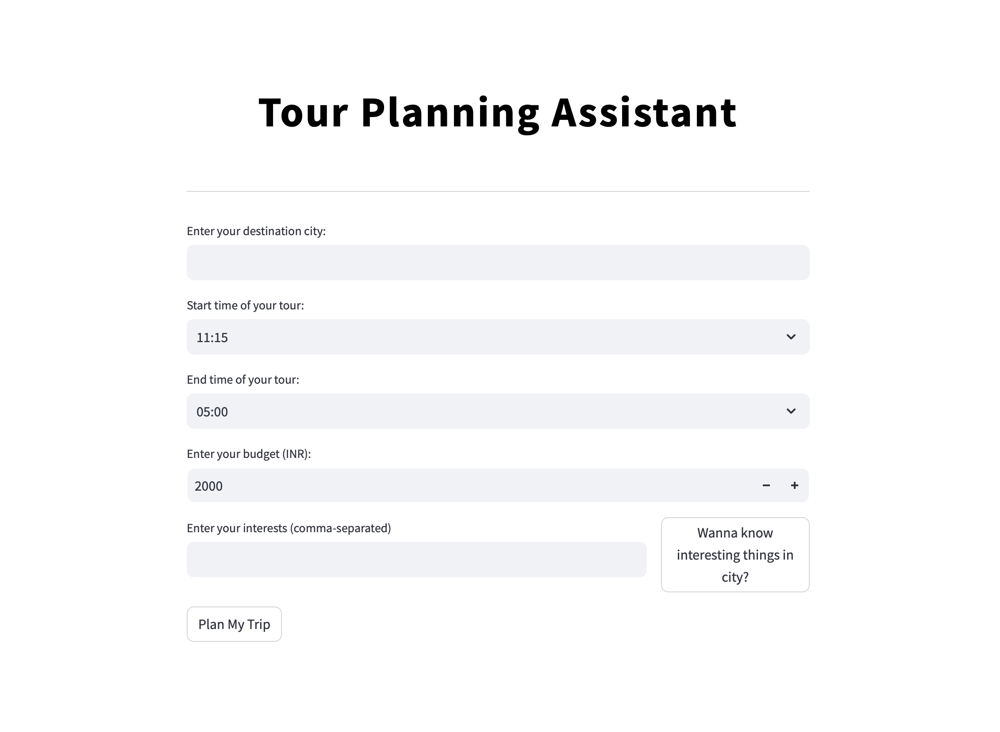

# AI Tour Planner
Welcome to the Tour Planning Assistant, a project designed to simplify one-day tour planning. This assistant integrates multiple intelligent agents to generate and optimize personalized travel itineraries based on user preferences, weather conditions, and geographical data.



## Features
* Personalized Itinerary Generation: Tailors one-day travel plans based on user preferences and constraints.
* Interactive Map Integration: Generates maps and directions using Google Maps API.
* Weather Awareness: Incorporates weather forecasts to suggest suitable activities and timings.
* Dynamic Optimization: Optimizes itineraries for time and travel efficiency using location data.
* Seamless User Interaction: Gathers and manages user preferences interactively for a smooth experience.

## Installation

### Prerequisites

* Python 3.8 or higher
* Docker (optional, for containerized deployment)


### Clone the Repository

```
git clone https://github.com/403errors/tour_planning_assistant.git
cd tour_planning_assistant
```

### Set Up Environment Variables

Create a .env file and define your API keys like this:

```
MAPS_API_KEY=<Your Google Maps API Key>
OPENWEATHER_API_KEY=<Your OpenWeather API Key>
```

### Install Dependencies

Install the required Python packages:

```
pip install -r requirements.txt
```

## Usage

Running Locally

```
streamlit run app.py
```


## Containerized Deployment
1.	Build the Docker image:

```
docker build -t tour_planning_assistant
```


2.	Run the container:

```
docker run -p 5000:5000 --env-file .env tour_planning_assistant
```

## How It Works
1. User Interaction
- Users provide preferences (e.g., locations, interests) via the UserInteractionAgent.
2. Weather Analysis
- The WeatherAgent fetches weather data to enhance activity recommendations. 
3. Itinerary Generation
- The ItineraryAgent integrates input from other agents (e.g., weather, maps) to create a draft itinerary.
4. Optimization
- The OptimizationAgent refines the plan, minimizing travel time and maximizing convenience.
5. Visualization
- The MapAgent generates interactive maps for easy navigation.

## Future Enhancements
* Complete implementation of MemoryAgent and Neo4jAgent.
* Add support for multi-day trips.
* Include recommendation systems for restaurants and attractions.
* Enhance UI/UX for a more interactive experience.

## Contributing

Contributions are welcome! Feel free to fork this repository, make improvements, and submit a pull request. For major changes, open an issue first to discuss your ideas.

## License

This project is licensed under the MIT License.

## Contact

For any inquiries or support, please contact:
> Email: pieisnot22by7@gmail.com

> GitHub: 403errors
